# 🔐 React Firebase Auth App

This project is a fully functional authentication system built with React and Firebase. It allows users to sign up, log in, reset their passwords, and update their email or password securely using Firebase Authentication. The app uses React Context API to manage the authentication state globally and ensures that only authenticated users can access certain routes or features.
It is designed to serve as a starter template or learning resource for developers looking to integrate Firebase Auth into a React application. All sensitive Firebase credentials are handled via environment variables for security.
---

## ✨ Features

* ✅ Firebase Authentication (Email/Password)
* 🔒 Protected Routes with React Router
* 🧠 Auth Context with React Context API
* 💌 Password reset via email
* 🔄 Update email or password with secure reauthentication
* 🧼 Clean and responsive UI using React Bootstrap

---

## 📸 Screenshots

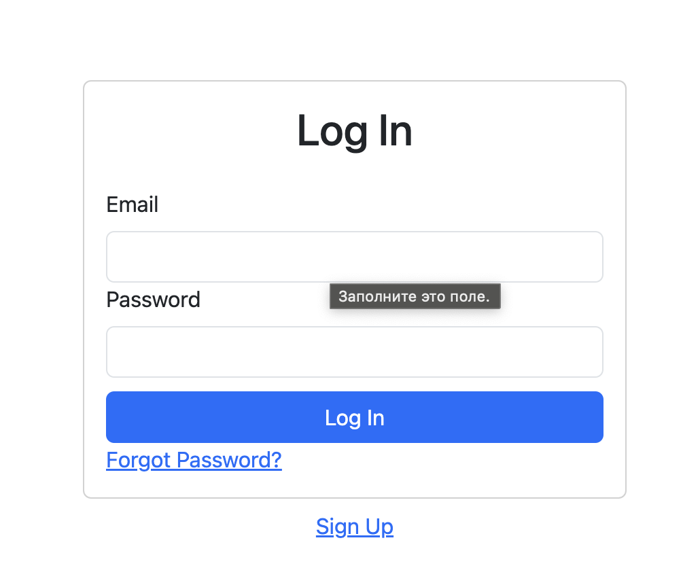
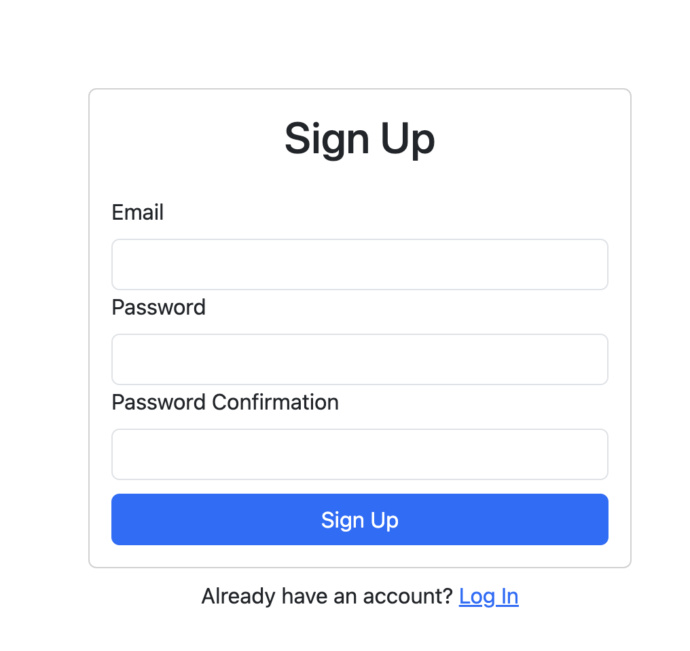
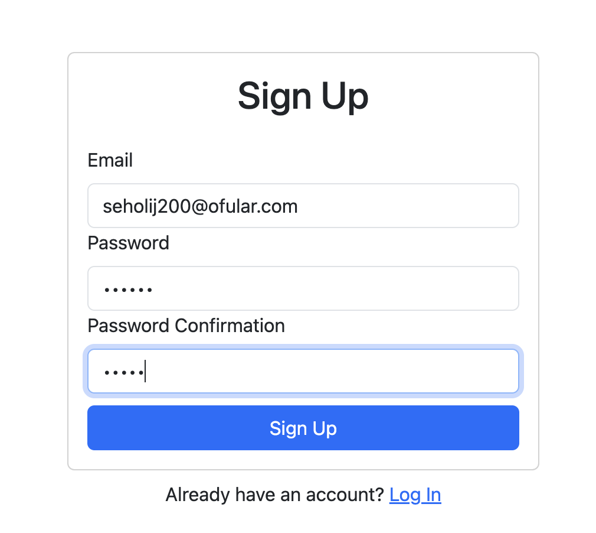
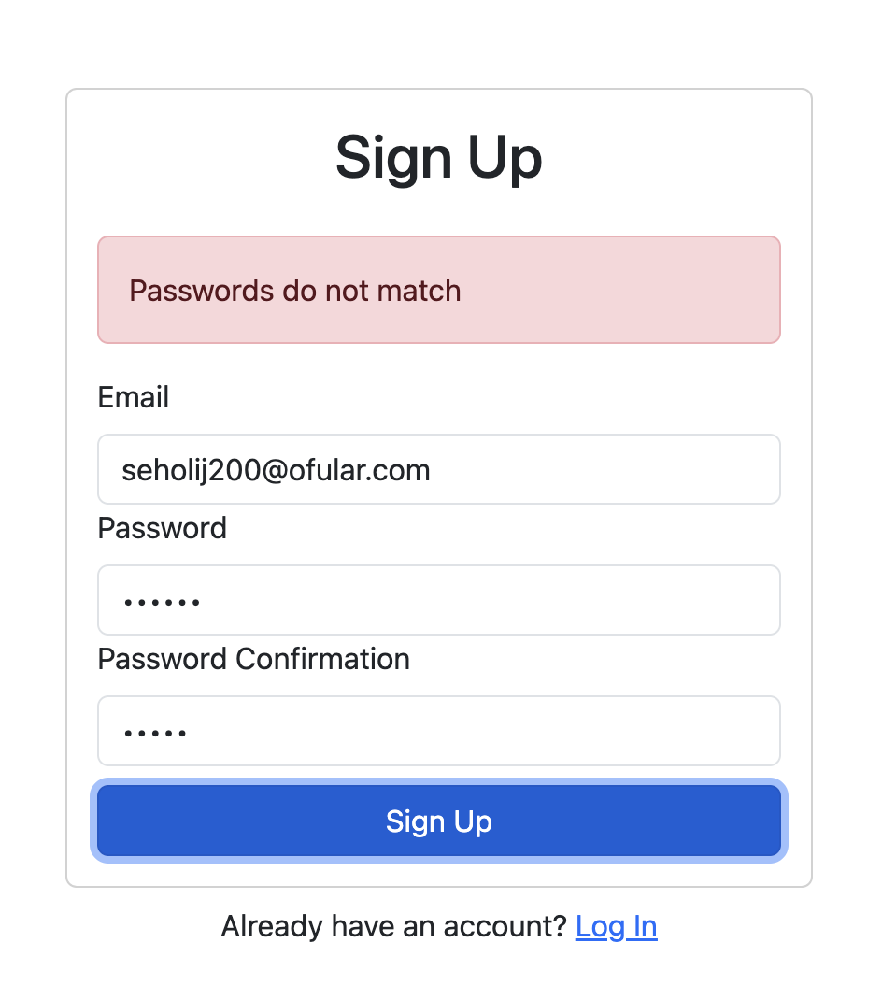
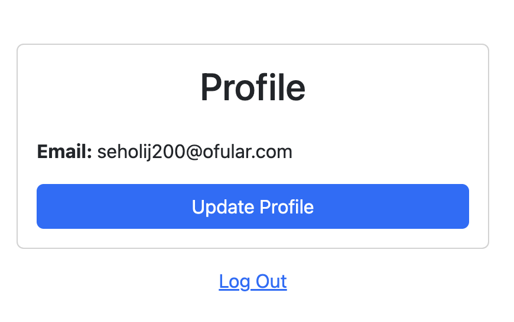
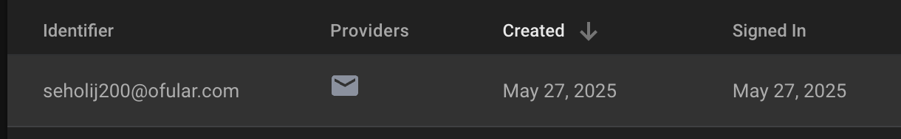
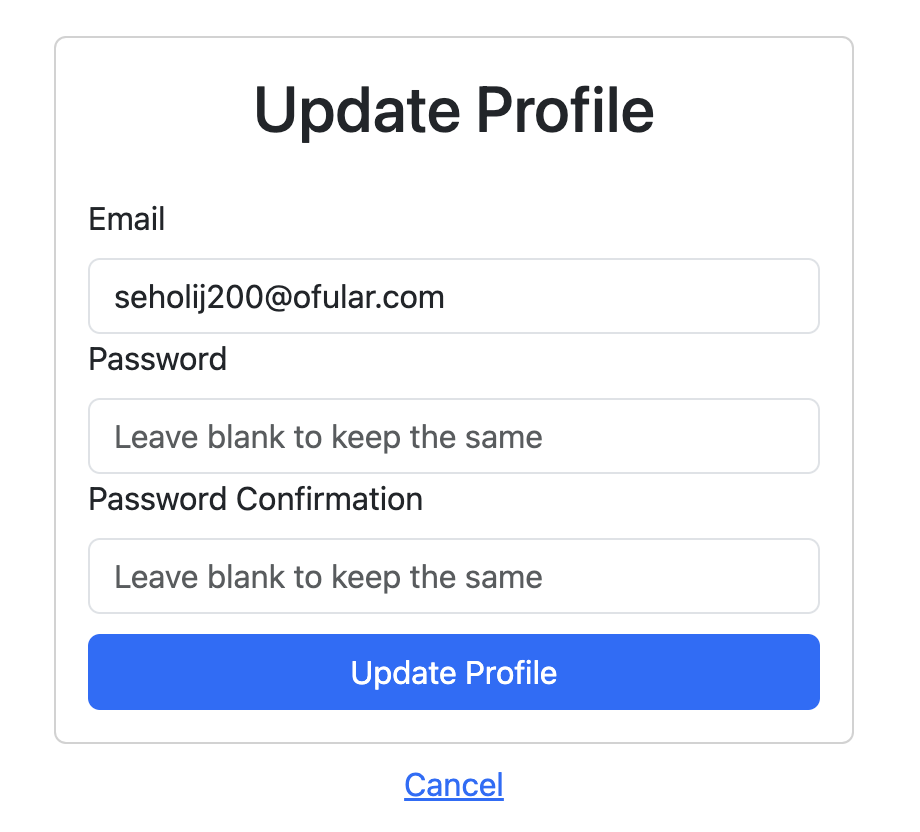
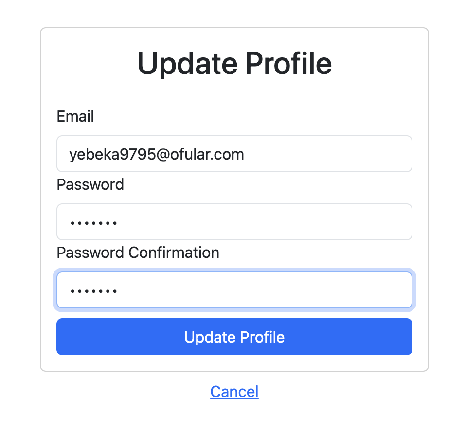
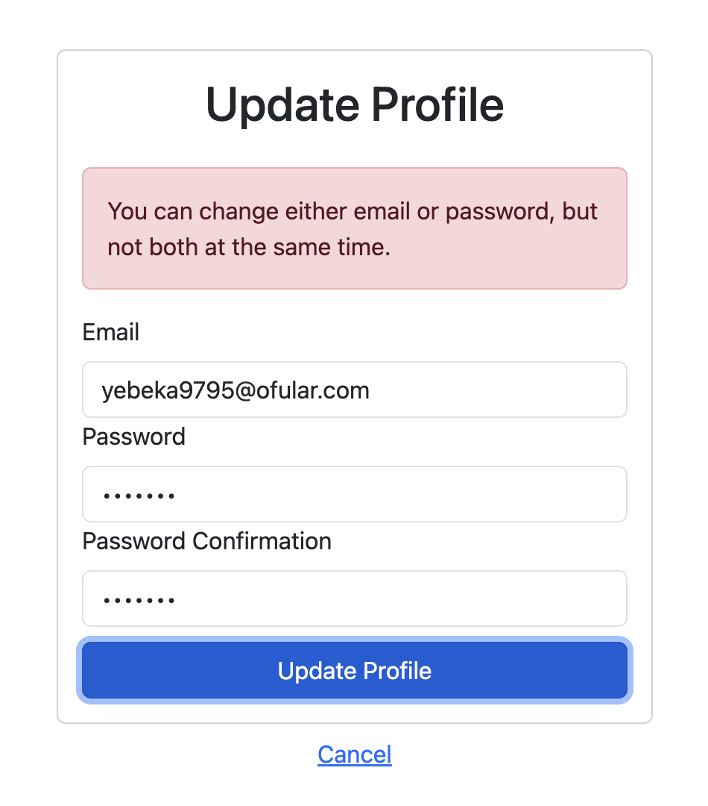
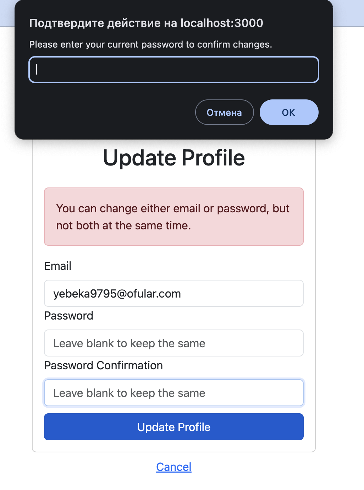
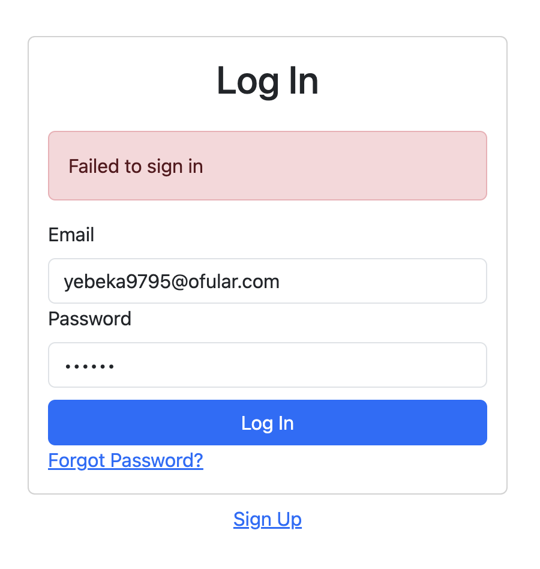
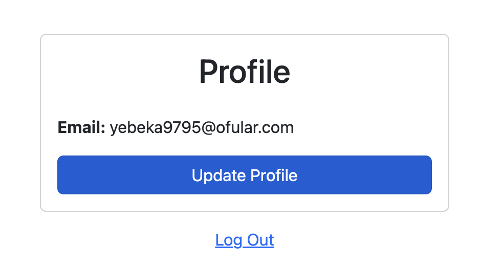
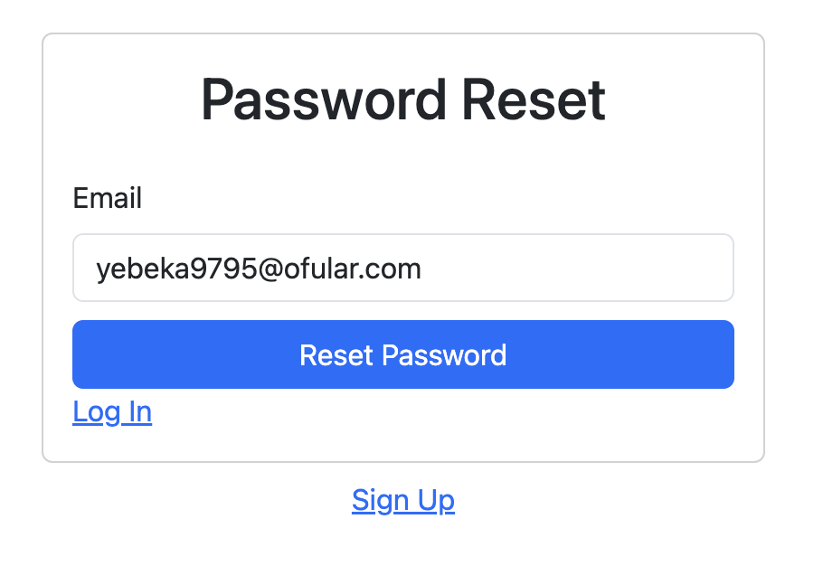
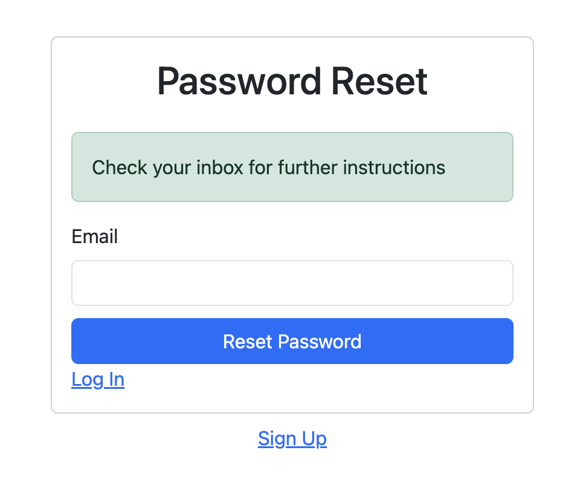
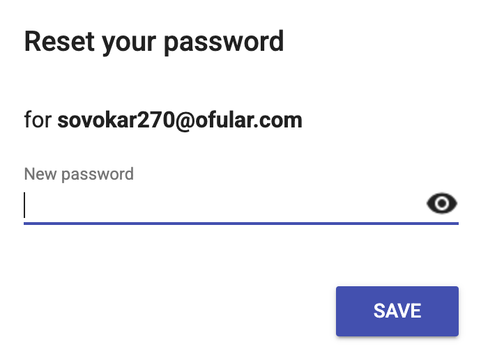

---

## 🛠️ Tech Stack

* **React**
* **Firebase Authentication**
* **React Router v6**
* **React Bootstrap**
* **Context API**

---

## 📁 Project Structure

```
src/
├── components/
│   ├── App.js
│   ├── Dashboard.js
│   ├── ForgotPassword.js
│   ├── Login.js
│   ├── PrivateRoute.js
│   ├── Signup.js
│   └── UpdateProfile.js
├── contexts/
│   └── AuthContext.js
├── firebase.js
└── index.js
```

---

## ⚙️ Firebase Setup

1. Go to [Firebase Console](https://console.firebase.google.com/) and create a new project.
2. Enable **Email/Password** authentication under **Authentication > Sign-in method**.
3. Copy your Firebase config and place it in a `.env.local` file at the root of your project:

```
REACT_APP_FIREBASE_API_KEY=your_api_key
REACT_APP_FIREBASE_AUTH_DOMAIN=your_project.firebaseapp.com
REACT_APP_FIREBASE_PROJECT_ID=your_project_id
REACT_APP_FIREBASE_STORAGE_BUCKET=your_project.appspot.com
REACT_APP_FIREBASE_MESSAGING_SENDER_ID=your_sender_id
REACT_APP_FIREBASE_APP_ID=your_app_id
```

4. Restart your development server after adding environment variables.

---

## 🚀 Getting Started

1. **Clone the repository**

```bash
git clone https://github.com/Adil-Bikiev/Authorization.git
cd Authorization
```

2. **Install dependencies**

```bash
npm install
```

3. **Start the development server**

```bash
npm start
```

---

## 🔐 Authentication Flow

* `AuthContext.js`: Manages all authentication logic.
* `PrivateRoute.js`: Protects private pages from unauthenticated access.
* `Signup.js`, `Login.js`, `ForgotPassword.js`, `UpdateProfile.js`: Handle user interactions.

---

## 🧪 Test Credentials (Optional)

To test the app without signing up every time, you can use hardcoded test credentials (not recommended for production).

---

## 📌 Notes

* Firebase will send verification emails when updating the user’s email.
* For security, the user must re-authenticate with their password before updating sensitive data.
* Passwords are never stored on the client.

---

## 📃 License

MIT License — Feel free to use and modify this project for personal or commercial use.
